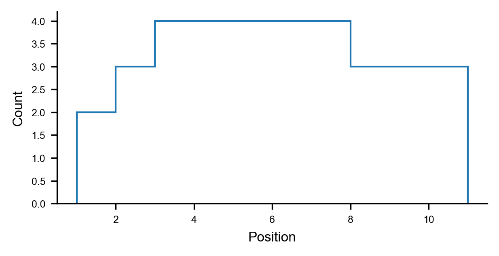

# `numpy` Gists
A tasting menu of  `numpy` snippets that I can never seem to remember.


## Binning Positions From Intervals
I am often interested in determining the frequency of positions given a list of start and end positions, but my old approach of initializing an empty array, iterating through the start and end positions, generating all the positions in the interval using `np.aranage`, appending the empty array and then using `np.unique` to count all of the unique positions is quite inefficient. The solution—which at the time of writing this I thought was quite clever—is to simply initialize an array of zeros for every unique position and then iterate through the intervals and update the array for the positions found in that interval.

```python
# Import packages.
import numpy as np

### Example Tracts ###
# T_1: 1, 2, 3, 4, 5 -> [1, 5].
# T_2: 3, 4, 5, 6, 7 -> [3, 7].
# T_3: 6, 7, 8, 9, 10 -> [6, 10].
# T_4: 1, 2, 3, 4, 5, 6, 7, 8, 9, 10 -> [1, 10].
# T_5: 2, 3, 4, 5, 6, 7, 8, 9, 10 -> [2, 10].

### Expected Output ###
# POS    COUNT
#  1       2 
#  2       3
#  3       4
#  4       4
#  5       4
#  6       4
#  7       5
#  8       3
#  9       3
# 10       3

# Intialize start positions (inclusive).
starts = np.array([1, 3, 6, 1, 2])
# Intialize end positions (inclusive).
ends = np.array([5, 7, 10, 10, 10])         

# Determine the minimum start and the maximum end positions.
min_pos = starts.min()
max_pos = ends.max()
# Intialize the position bins and counts.
pos_bins = np.arange(min_pos, max_pos+1)
pos_counts = np.zeros(pos_bins.size, dtype=int)
# Iterate through each interval.
for start, end in zip(starts, ends):
    # Update the position counts for this interval.
    pos_counts[start-min_pos:end-min_pos+1] += 1
    
# Show the unique positions.
print(pos_bins)
>>> [ 1  2  3  4  5  6  7  8  9 10]

# Show the position counts.
print(pos_counts)
>>> [2 3 4 4 4 4 4 3 3 3]
```

The outputs can be efficiently plotted as a histogram like so.

```python
# Import packages.
import matplotlib.pyplot as plt

# Intialize the figure and axes.
fig = plt.figure(
    figsize=(4, 2), dpi=300,
    facecolor='white', constrained_layout=True,
)
ax = fig.add_subplot(111)
# Plot the histogram.
ax.hist(
    pos_bins,
    bins=np.arange(pos_bins.min(), pos_bins.max() + 1.05),
    weights=pos_counts.astype(int),
    histtype='step', color='tab:blue',
)
# Label the axes.
ax.set_xlabel('Position')
ax.set_ylabel('Count')
# Show the plot.
plt.show()
```
 
