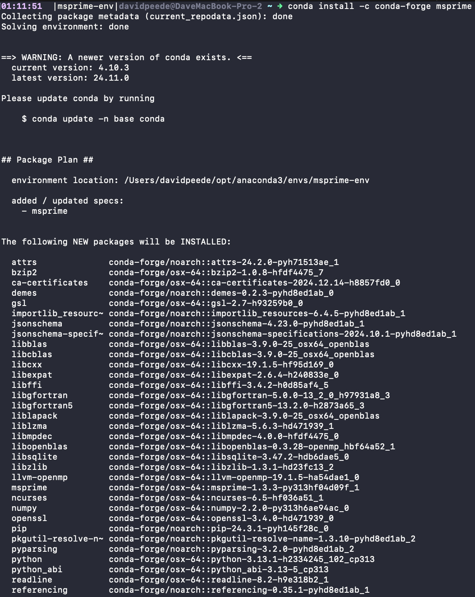

# Tree-Sequence Tutorial

Before starting the tutorial, you will need to install `msprime`. According to the documentation, one of the most straightforward ways to do this is via Anaconda:

```bash
# Create a new anaconda enviornment and install msprime.
conda create --name msprime-env
conda activate msprime-env
conda install -c conda-forge msprime
```





After installation, start a Python session, import the `msprime` package, and check that the version number is up to date.

```bash
# Start a python session.
python
```


```python
# Import msprime.
import msprime
# Print the version.
print("msprime", msprime.__version__)
```


So that you get identical results, ensure you are using version `1.3.3`.

## Overview with a Single Tree

Let's start by simulating a tree-sequence with a single tree. To do so, we will ignore recombination (for now).

```python
# Perform an ancestry simulation for three samples with an effective population size of 10,000.
ts = msprime.sim_ancestry(
    samples=[msprime.SampleSet(3, ploidy=1)],  # Sample haploids.
    population_size=1e4,
    random_seed=42,
)
# Show the tree-sequence.
print(ts)
```


The code above simulates a tree-sequence for three monoploid samples that originate from a population with a diploid effective population size of 10,000. Since there is no recombination, there should only be a single tree in this tree-sequence. It might be helpful to visualize it:

```python
# Print the tree as a text output.
print(ts.draw_text())
```


Because we only have one tree, we can directly extract it—we will go over iterating through trees later.

```python
# Extract the first and only tree from the tree-sequence.
tree = ts.first()
# Print a summary.
print(tree)
```


### Nodes and Edges

The node table records the information associated with a node which represents an ancestral haploid genome—**NOTE:** The `id` column is only visualized but not actually recorded. 
- `flags` column has a value of 1 if the node is a sample node and 0 otherwise.
- `population` column records the population id for the node and is -1 otherwise.
- `individual` column records the individual id for the node and is -1 otherwise.
- `time` column records the birth time of that node.
- `metadata` column contains any associated metadata for that node.  


```python
# View the node table.
print(ts.tables.nodes)
```


The edge table records the parent-child relationship between a pair of nodes over a genomic interval—**NOTE:** The `id` column is only visualized but not actually recorded. 
- `left` column records the left coordinate (inclusive) of the half open genomic interval `[left, right)` over which the `child` node is inherited from a given `parent` node.
- `right` column records the right coordinate (inclusive) of the half open genomic interval `[left, right)` over which the `child` node is inherited from a given `parent` node.
- `parent` column records the node id of the `parent` node.
- `child` column records the node id of the `child` node.
- `metadata` column contains any associated metadata for that node. 

```python
# View the edge table.
print(ts.tables.edges)
```


### Tree Traversal

Often one may want to traverse the tree to extract information from nodes. However, there are multiple different orderings in which we can visit all the nodes. The most efficient way for traversing a tree differs based on the specific analysis, but here is a quick overview of what is implemented in `msprime`—**NOTE:** Subtrees are sorted by node id such that the "left" subtree corresponds to the child node with the smallest node id and the "right" subtree is child node with the larger node id.

- **Preorder**: The root node is visited first, followed by its left subtree, and then its right subtree. 
- **Inorder**: The left subtree is visited first, followed by the root, and then the right subtree.
- **Postorder**: The left subtree is visited first, then the right subtree, and finally the root.

```python
# For every traversal order.
for trav_order in ["preorder", "inorder", "postorder"]:
    # Print the traversal order.
    print(f"{trav_order}:\t", list(tree.nodes(order=trav_order)))
```


Let's quickly recap the traversal methods.

**Preorder (root $\rightarrow$ left subtree $\rightarrow$ right subtree)**
1. Start at the root, node **4**.
2. Visit the left subtree, node **2**.
3. Visit the right subtree:
   - Node **3** (root of the right subtree).
   - Node **0** (left child of node 3).
   - Node **1** (right child of node 3).

**Inorder (left subtree $\rightarrow$ root $\rightarrow$ right subtree)**
1. Start with the left subtree of the root, node **2**.
2. Visit the root, **Node 4**.
3. Visit the right subtree:
   - Node **0** (left child of node 3).
   - Node **3** (root of the right subtree).
   - Node **1** (right child of node 3).

**Postorder (left subtree $\rightarrow$ right subtree $\rightarrow$ root)**

1. Start with the left subtree of the root, node **2**.
2. Visit the right subtree:
   - Node **0** (left child of node 3).
   - Node **1** (right child of node 3).
   - Node **3** (root of the right subtree).
3. Visit the root, node **4**.

### Node Attributes

While traversing a tree, you may need information about nodes. For instance, one may be interested in knowing if the node is an internal or leaf node, the children nodes of an internal node, the parent of a specified node, the time of the specified node, the branch length of the edge connecting the specified node to its parent, or maybe just the edge id connecting the specified node to its parent. Note that if a traversal method is not specified the default is a preorder traversal.

```python
# Traverse the tree in preorder.
for node in tree.nodes():
    # If the node is a leaf.
    if tree.is_leaf(node):
        # Find the parent node.
        parent = tree.parent(node)
        # Find the time of the node.
        time = tree.time(node)
        # Find the branch length between the node and its parent.
        branch_length = tree.branch_length(node)
        # Find the edge id of the edge between the node and its parent.
        edge_id = tree.edge(node)
        # Print a summary.
        print(
            f"Node {node} is a leaf node at time {time} whose parent is node {parent} and branch length {branch_length} (edge {edge_id})."
        )
    # Else, the node is an internal node.
    else:
        # Find the children of the node.
        left_child, right_child = tree.children(node)
        # Find the time of the node.
        time = tree.time(node)
        # Find the branch length between the left child and the node.
        left_branch_length = tree.branch_length(left_child)
        # Find the branch length between the right child and the node.
        right_branch_length = tree.branch_length(right_child)
        # Find the edge id of the edge between the left child and the node.
        left_edge_id = tree.edge(left_child)
        # Find the edge id of the edge between the right child and the node.
        right_edge_id = tree.edge(right_child)
        # Print a summary.
        print(
            f"Node {node} is an internal node at time {time} whose left child is node {left_child} with a branch length of {left_branch_length} (edge {left_edge_id}) and whose right child is node {right_child} with a branch length of {right_branch_length} (edge {right_edge_id})."
        )
```


## Tree-Sequences

So far, we have ignored recombination. However, recombination is important because it creates multiple trees along the genome that are spatially autocorrelated. Let's re-run our previous example with recombination to generate a sequence of trees—**NOTE:** Previously we did not need to define a sequence length since there was no recombination, however when there is recombination you will need to specify a sequence length.

```python
# Perform an ancestry simulation for three samples over a 10kb sequence with an effective population size of 10,000 and a recombination rate of 1e-8.
ts = msprime.sim_ancestry(
    samples=[msprime.SampleSet(3, ploidy=1)],  # Sample haploids.
    population_size=1e4,
    recombination_rate=1e-8,
    sequence_length=1e4,
    random_seed=42,
)
# Show the tree-sequence.
print(ts)
```


From the output we can see that there are three trees in this tree-sequence, with seven unique nodes, and ten unique edges. Now let's visualize the tree for clarity and verify that the tree-sequence summary is correct.

```python
# Print the tree as a text output.
print(ts.draw_text())
# Print the number of nodes in the tree-sequence.
print(f"There are {ts.num_nodes} nodes in the tree-sequence.")
# Print the number of edges in the tree-sequence.
print(f"There are {ts.num_edges} edges in the tree-sequence.")
```


Now let's view the node and edge tables for this tree sequence.

```python
# Print the node table.
print(ts.tables.nodes)
# Print the edge table.
print(ts.tables.edges)
```


Note that unlike the previous example for a single tree, the edges in a tree-sequence span for varying genomic intervals.

### Iterating Over Trees

Unlike our first example without recombination, Trees in a tree-sequence are defined by the half-open interval `[left, right)` defined by the recombination breakpoints. Let's now iterate through every tree in the tree-sequence and record the tree's index, genomic interval, genomic span, most recent common ancestor (MRCA), time to the most recent common ancestor (TMRCA), and the total branch length.

```python
# Iterate over the trees in the tree-sequence.
for tree in ts.trees():
    # Find the tree's index.
    index = tree.index
    # Find the tree's genomic interval.
    interval = tree.interval
    # Find the tree's genomic span.
    span = tree.span
    # Find the tree's MRCA node.
    mrca = tree.root
    # Find the tree's TMRCA.
    tmrca = tree.time(mrca)
    # Find the tree's total branch length.
    total_branch_length = tree.total_branch_length
    # Print a summary.
    print(
        f"Tree {index} is at the genomic interval [{interval.left}, {interval.right}) with span {span}bp whose MRCA node is {mrca} at time {tmrca} with total branch length {total_branch_length}."
    )
```


Now let's combine what we have learned thus far by iterating over the trees in the tree-sequence, then traversing the tree to find the first coalescent event, and then recording time of the coalescent event and the two lineages involved.

```python
# Iterate over the trees in the tree-sequence.
for tree in ts.trees():
    # Find the tree's index.
    index = tree.index
    # Initialize variables.
    first_coal_node = None
    first_coal_time = float("inf")
    # Traverse the tree in preorder.
    for node in tree.nodes():
        # If the node is an internal node.
        if tree.is_internal(node):
            # Find the time of the node.
            time = tree.time(node)
            # Determine if this is the earliest coalescent event we've seen.
            if time < first_coal_time:
                # Update the node of the first coalescent event.
                first_coal_node = node
                # Update the the time of the first coalescent event.
                first_coal_time = time
    # Find the lineages that coalesce first.
    left_child, right_child = tree.children(first_coal_node)
    # Print a summary.
    print(
        f"Tree {index}: Leaf nodes {left_child} and {right_child} coalesce first at time {first_coal_time}."
    )
```


## Demography

Up to now, we have simulated a single population with a constant size. Now that we are more familiar with tree-sequences, let's generate a `Demography` object in `msprime` for a single population with a constant population size of 10,000.

```python
# Initialize the demography object.
one_pop_const_demo = msprime.Demography()
# Initialize the population size of 10,000.
one_pop_const_demo.add_population(name="A", initial_size=1e4)
# View the demographic history.
print(one_pop_const_demo.debug())
```


Now, let's define a demographic history with two populations that diverged from an ancestral population 15,000 generations ago, all with a constant population size of 10,000.

```python
# Initialize the demography object.
two_pop_const_demo = msprime.Demography()
# Initialize the populations and their associated sizes of 10,000.
two_pop_const_demo.add_population(name="A", initial_size=1e4)
two_pop_const_demo.add_population(name="B", initial_size=1e4)
two_pop_const_demo.add_population(name="C", initial_size=1e4)
# Initialize the time when populations A and B split from C 15,000 generations ago.
two_pop_const_demo.add_population_split(time=1.5e4, derived=["A", "B"], ancestral="C")
# View the demographic history.
print(two_pop_const_demo.debug())
```


Next, we'll set up a scenario where population "A" experienced a bottleneck 10,000 generations ago, reducing its population size from 10,000 to 5,000. 

```python
# Initialize the demography object.
two_pop_bott_demo = msprime.Demography()
# Initialize the populations and their associated sizes.
two_pop_bott_demo.add_population(name="A", initial_size=5e3)
two_pop_bott_demo.add_population_parameters_change(
    time=1e4, population="A", initial_size=1e4
)
two_pop_bott_demo.add_population(name="B", initial_size=1e4)
two_pop_bott_demo.add_population(name="C", initial_size=1e4)
# Initialize the time when populations A and B split from C 15,000 generations ago.
two_pop_bott_demo.add_population_split(time=1.5e4, derived=["A", "B"], ancestral="C")
# View the demographic history.
print(two_pop_bott_demo.debug())
```


Let's simulate a 1Mb segment, sampling two lineages per population under each of these demographic models.

```python
# Simulate a tree-sequence under the one population model.
ts_one_pop_const_demo = msprime.sim_ancestry(
    samples=[msprime.SampleSet(2, ploidy=1, population="A")],  # Sample haploids.
    demography=one_pop_const_demo,
    recombination_rate=1e-8,
    sequence_length=1e6,
    random_seed=42,
)
# Show the tree-sequence.
print(ts_one_pop_const_demo)
```


```python
# Simulate a tree-sequence under the two population model.
ts_two_pop_const_demo = msprime.sim_ancestry(
    samples=[
        msprime.SampleSet(2, ploidy=1, population="A"),
        msprime.SampleSet(2, ploidy=1, population="B"),
    ],  # Sample haploids.
    demography=two_pop_const_demo,
    recombination_rate=1e-8,
    sequence_length=1e6,
    random_seed=42,
)
# Show the tree-sequence.
print(ts_two_pop_const_demo)
```


```python
# Simulate a tree-sequence under the two population model with a bottleneck event in population A.
ts_two_pop_bott_demo = msprime.sim_ancestry(
    samples=[
        msprime.SampleSet(2, ploidy=1, population="A"),
        msprime.SampleSet(2, ploidy=1, population="B"),
    ],  # Sample haploids.
    demography=two_pop_bott_demo,
    recombination_rate=1e-8,
    sequence_length=1e6,
    random_seed=42,
)
# Show the tree-sequence.
print(ts_two_pop_bott_demo)
```


Now let's compute the pairwise TMRCA estimates for all samples within and between populations, per demographic model—**NOTE:** Population A's id is 0 and B's id is 1.

```python
# Initialize the sequence length.
seq_len = 1e6
# Extract the sample indices.
idx_1, idx_2 = ts_one_pop_const_demo.samples(0)
# Initialize the TMRCA.
tmrca_one_pop_const_demo = 0
# Iterate over the trees in the tree-sequence.
for tree in ts_one_pop_const_demo.trees():
    # Find the tree's genomic span.
    span = tree.span
    # Determine the tree's weight.
    tree_weight = span / seq_len
    # Find the TMRCA.
    tmrca = tree.tmrca(idx_1, idx_2)
    # Update the TMRCA.
    tmrca_one_pop_const_demo += tmrca * tree_weight
# Print a summary.
print(
    f"The TMRCA of the two samples in the one population model is {tmrca_one_pop_const_demo}."
)
```


```python
# Initialize the sequence length.
seq_len = 1e6
# Extract the sample indices.
pop_a1, pop_a2 = ts_two_pop_const_demo.samples(0)
pop_b1, pop_b2 = ts_two_pop_const_demo.samples(1)
# Initialize the TMRCAs.
tmrca_two_pop_const_demo = {
    "A": {(pop_a1, pop_a2): 0},
    "B": {(pop_b1, pop_b2): 0},
    "A-B": {
        (pop_a1, pop_b1): 0,
        (pop_a1, pop_b2): 0,
        (pop_a2, pop_b1): 0,
        (pop_a2, pop_b2): 0,
    },
}
# Iterate over the trees in the tree-sequence.
for tree in ts_two_pop_const_demo.trees():
    # Find the tree's genomic span.
    span = tree.span
    # Determine the tree's weight.
    tree_weight = span / seq_len
    # Find the TMRCAs.
    tmrca_two_pop_const_demo["A"][(pop_a1, pop_a2)] += (
        tree.tmrca(pop_a1, pop_a2) * tree_weight
    )
    tmrca_two_pop_const_demo["B"][(pop_b1, pop_b2)] += (
        tree.tmrca(pop_b1, pop_b2) * tree_weight
    )
    tmrca_two_pop_const_demo["A-B"][(pop_a1, pop_b1)] += (
        tree.tmrca(pop_a1, pop_b1) * tree_weight
    )
    tmrca_two_pop_const_demo["A-B"][(pop_a1, pop_b2)] += (
        tree.tmrca(pop_a1, pop_b2) * tree_weight
    )
    tmrca_two_pop_const_demo["A-B"][(pop_a2, pop_b1)] += (
        tree.tmrca(pop_a2, pop_b1) * tree_weight
    )
    tmrca_two_pop_const_demo["A-B"][(pop_a2, pop_b2)] += (
        tree.tmrca(pop_a2, pop_b2) * tree_weight
    )
# Print a summary.
print(
    f"The TMRCA of the two samples in population A is {tmrca_two_pop_const_demo['A'][(pop_a1, pop_a2)]}."
)
print(
    f"The TMRCA of the two samples in population B is {tmrca_two_pop_const_demo['B'][(pop_b1, pop_b2)]}."
)
print(
    f"The mean TMRCA between two samples in populations A and B is {sum([value for value in tmrca_two_pop_const_demo['A-B'].values()]) / 4}."
)
```


```python
# Initialize the sequence length.
seq_len = 1e6
# Extract the sample indices.
pop_a1, pop_a2 = ts_two_pop_bott_demo.samples(0)
pop_b1, pop_b2 = ts_two_pop_bott_demo.samples(1)
# Initialize the TMRCAs.
tmrca_two_pop_bott_demo = {
    "A": {(pop_a1, pop_a2): 0},
    "B": {(pop_b1, pop_b2): 0},
    "A-B": {
        (pop_a1, pop_b1): 0,
        (pop_a1, pop_b2): 0,
        (pop_a2, pop_b1): 0,
        (pop_a2, pop_b2): 0,
    },
}
# Iterate over the trees in the tree-sequence.
for tree in ts_two_pop_bott_demo.trees():
    # Find the tree's genomic span.
    span = tree.span
    # Determine the tree's weight.
    tree_weight = span / seq_len
    # Find the TMRCAs.
    tmrca_two_pop_bott_demo["A"][(pop_a1, pop_a2)] += (
        tree.tmrca(pop_a1, pop_a2) * tree_weight
    )
    tmrca_two_pop_bott_demo["B"][(pop_b1, pop_b2)] += (
        tree.tmrca(pop_b1, pop_b2) * tree_weight
    )
    tmrca_two_pop_bott_demo["A-B"][(pop_a1, pop_b1)] += (
        tree.tmrca(pop_a1, pop_b1) * tree_weight
    )
    tmrca_two_pop_bott_demo["A-B"][(pop_a1, pop_b2)] += (
        tree.tmrca(pop_a1, pop_b2) * tree_weight
    )
    tmrca_two_pop_bott_demo["A-B"][(pop_a2, pop_b1)] += (
        tree.tmrca(pop_a2, pop_b1) * tree_weight
    )
    tmrca_two_pop_bott_demo["A-B"][(pop_a2, pop_b2)] += (
        tree.tmrca(pop_a2, pop_b2) * tree_weight
    )
# Print a summary.
print(
    f"The TMRCA of the two samples in population A is {tmrca_two_pop_bott_demo['A'][(pop_a1, pop_a2)]}."
)
print(
    f"The TMRCA of the two samples in population B is {tmrca_two_pop_bott_demo['B'][(pop_b1, pop_b2)]}."
)
print(
    f"The mean TMRCA between two samples in populations A and B is {sum([value for value in tmrca_two_pop_bott_demo['A-B'].values()]) / 4}."
)
```


How and why do the within and between population TMRCA estimates differ between demographic models?